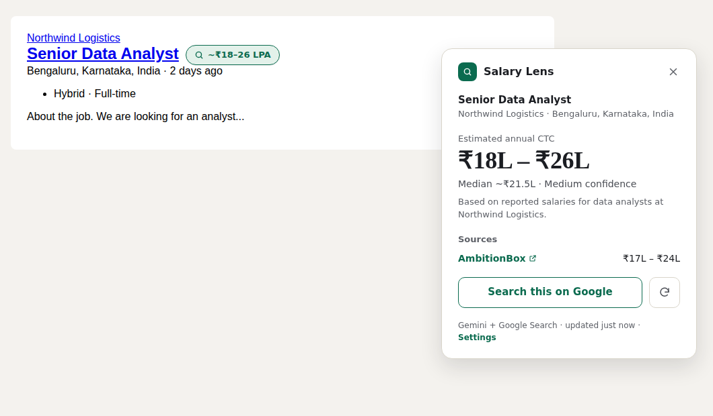

# Salary Lens

A Chrome extension that shows the expected salary for the job you're looking at on LinkedIn, Naukri, Indeed, foundit, and most other job pages. No more copying the title and company into Google.


<sub>Demo page with sample data.</sub>

- **Listed salary first.** If the posting shows a salary, the badge shows it straight away, with no API call.
- **Market estimate with sources.** Otherwise it asks Google's Gemini (with Google Search) for a salary range, a median, and links to where the numbers came from (AmbitionBox, Glassdoor, Levels.fyi…).
- **Your own key, your own data.** You use your own Gemini API key. There's no server, no account, and no analytics. Your key never leaves your browser except to go to Google.

## Install

Salary Lens isn't on the Chrome Web Store, so you install it yourself. It takes about two minutes.

1. **Download it.** Go to [Releases](../../releases) and download the latest `salary-lens-vX.Y.Z.zip`, then unzip it. You can also clone this repo instead:
   ```
   git clone https://github.com/<your-username>/salary-lens.git
   ```
2. Keep the folder somewhere permanent (for example `Documents`). Chrome loads the extension from it every time.
3. Open `chrome://extensions` and turn on **Developer mode** (top right).
4. Click **Load unpacked** and choose the folder that contains `manifest.json`: the unzipped release folder, or the `extension` folder of the cloned repo.
5. Pin it: click the puzzle-piece icon in the toolbar, then the pin next to Salary Lens.

Also works in Edge, Brave, Arc, and other Chromium browsers (version 114 or newer).

> Chrome may show a "Disable developer mode extensions" notice at startup. That's normal for extensions installed this way; close it with the X.

### Add your Gemini API key

1. Get a key at [Google AI Studio](https://aistudio.google.com/apikey).
2. The Salary Lens settings page opens after installing. You can also reopen it by right-clicking the toolbar icon and choosing **Options**. Paste the key and click **Save and test**.

**Free keys vs keys with billing.** As of September 2026, Google doesn't include Search grounding on the Gemini free tier ([pricing](https://ai.google.dev/gemini-api/docs/pricing)):

| Your key | What you get |
| --- | --- |
| Billing enabled (includes a monthly allowance of free searches) | Live Google Search lookups with source links |
| Free tier | An AI-only estimate from the model's own knowledge, labelled "AI estimate, not live-searched" |

**Save and test** tells you which one your key supports. Listed salaries and the "Search this on Google" button work without any key.

### Updating

Download the new release (or `git pull`), replace the folder's contents, then click the reload arrow on Salary Lens in `chrome://extensions` and reload your job tabs.

## Using it

- Open a job on a supported site. A badge appears next to the title: blue for a salary listed on the posting, green for an estimate. Click it for the details card.
- On any other site, click the Salary Lens toolbar icon to scan the current page.
- In settings you can turn automatic lookups off, show amounts per month, set a daily lookup limit, and change the Gemini model.

## Privacy and security

- Salary Lens sends only the job title, company, location, experience, and any listed salary to Google's Gemini API, using your key. Nothing goes anywhere else. See [PRIVACY.md](PRIVACY.md).
- Job pages can never read your key. Lookups are rate-limited so no page can run up your bill. Anything the model writes is shown as plain text with links removed. The full review is in [SECURITY.md](SECURITY.md).
- Good practice: restrict your key to the **Generative Language API** in [Google Cloud credentials](https://console.cloud.google.com/apis/credentials), and set a budget alert if billing is on.

## How it works

```
job page ──(content script reads title, company, location, listed salary)──▶ badge + card
                     │  message (never includes the API key)
                     ▼
background service worker ── cache hit? ──▶ answer (7-day cache)
                     │ miss → spending guard → Gemini generateContent + google_search tool
                     ▼
            JSON salary range + Google grounding links
```

```
extension/            ← the folder Chrome loads
  manifest.json       Manifest V3: permissions and the sites the content script runs on
  background.js       Lookups, caching, message checks, toolbar button
  content/
    extract.js        Reads job details: LinkedIn, Naukri, Indeed, foundit + schema.org JobPosting
    ui.js             The badge and card (closed Shadow DOM)
    main.js           Watches the page, shows the badge, requests estimates
    format.js         LPA / lakhs / crores for INR, K/M elsewhere, per year or per month
  lib/
    gemini.js         Prompt, API call, JSON parsing, sources, errors, search fallback
    security.js       Link/text sanitizing, sender checks, key format check
    ratelimit.js      Spending guard (per minute / hour / day)
    cache.js, settings.js
  options/            Settings and first-run page
tests/                Node test runner, no dependencies
scripts/package.sh    Builds the release zip
```

## Development

No build step and no dependencies. Edit the files in `extension/`, then click reload on the extension card in `chrome://extensions`.

```
npm test          # unit tests (Node 20+)
npm run check     # syntax-check every script
npm run package   # dist/salary-lens-vX.Y.Z.zip
```

### When a job site changes its layout

Job sites rename their CSS classes often. If the badge stops appearing, update that site's selector list in `extension/content/extract.js`. Each list runs from most specific to most generic, and schema.org JSON-LD is used as a fallback wherever the site provides it. Please open an issue with a screenshot if you spot one.

### Releasing

1. Bump `version` in `extension/manifest.json` (and `package.json`), and add an entry to `CHANGELOG.md`.
2. Commit, then tag and push:
   ```
   git tag v0.2.3
   git push origin main --tags
   ```
3. The Release workflow runs the tests and publishes a GitHub Release with the zip attached.

See [CONTRIBUTING.md](CONTRIBUTING.md) for more.

## License

[MIT](LICENSE)

Salary Lens is not affiliated with LinkedIn, Naukri, Indeed, foundit, Glassdoor, AmbitionBox, or Google. Estimates are approximate. Always check the sources.
